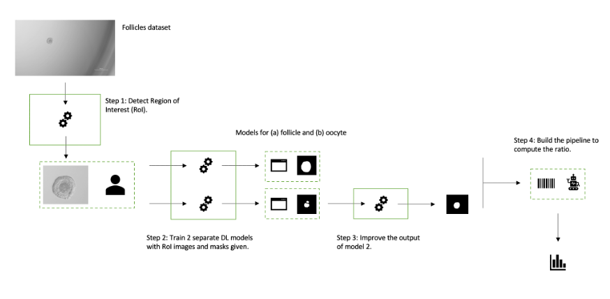
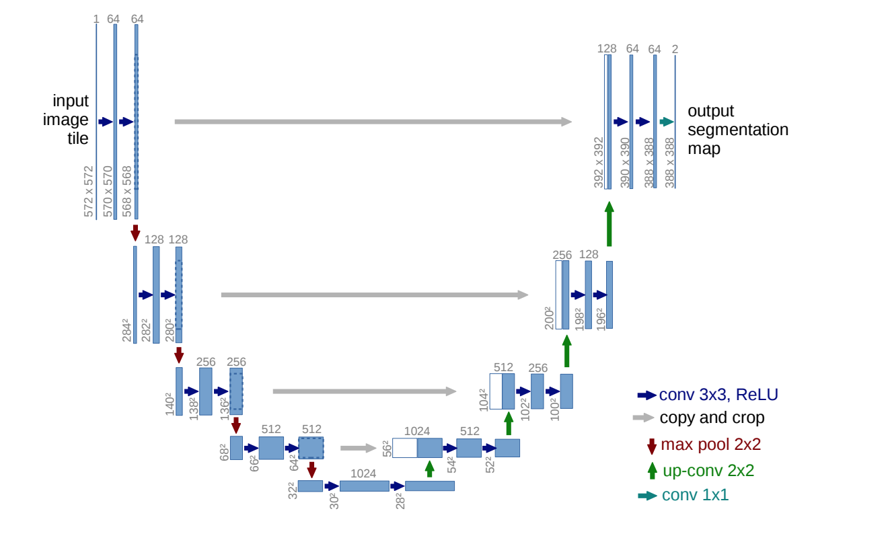
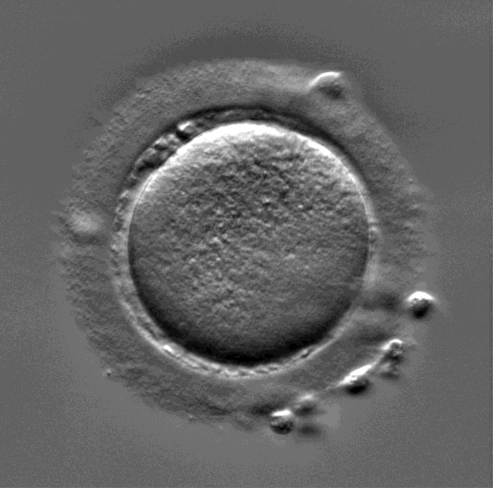
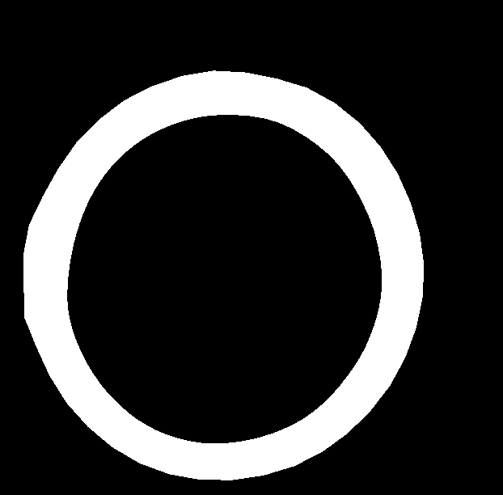
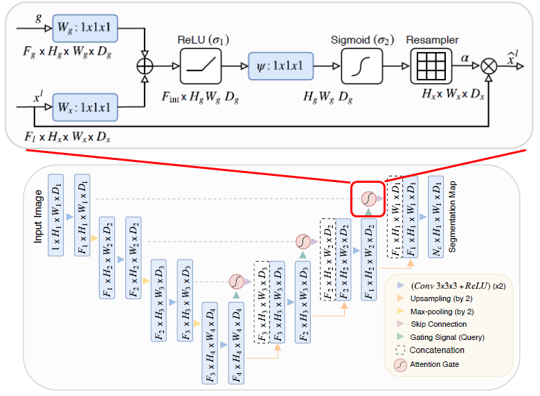

# Follicle-Oocyte Ratio and its contribution for a Healthy Oocyte Maturation

## Overview
We propose a deep learning method to segment the areas of oocytes and follicles in a follicle image database. 
We utilize a pair of deep learning CNNs to segment the areas, while using some pre-processing and post-processing techniques to enhance the results. 
Then, we use the areas computed along with other data available for these follicles, to build a model for predicting a limited number of them to be used for maturation. 
The goal is to select the most likely promising follicles, while we are also studying the effect of the ratio oocyte-follicle to the final outcome. 
That way we can provide the experts with a tool for an automatic and safe follicle selection for human treatment in assisted reproductive technologies.

## Method

### ROI extraction
First we process the images to extract the region of interest (ROI) of the images using the 'ROI_pipeline.py' file. We resize both the images using the following principle: the region of interest if found by applying a local entropy kernel on all the image. Then, we theresold the obtained entropy mask to keep only the pixels where entropy is above the threshold. Using cv2 module 'findContours' method we extract the contours of the mask. Next, using a criterion based on the ratio between the area of the contour and its perimeter we are able to eliminate the artifacts that are present in the entropy mask by keeping only the round shaped contour corresponding to the cell. Thus the artifacts like the Petri dish border containing the cell are eliminated, and the algorithm succes rate found itself greatly increased.

### Follicle and oocyte segmentation
Next step is training a deep learning model in order to segment the different parts of the ovocytes (outter part and inner part). For that we chose to use the classical Unet neural network :

The training is made in two phases in the 'Attention_Unet_Inner_Part_Segmentation.py' and 'Attention_Unet_Outter_Part_Segmentation.py' files: first phase, we pretrain the Unet on 300 images from a dataset of a similar task dataset and second phase, we finetune the Unet on 65 images from our labelled oocyte dataset. The original loss function we used was the Dice Loss.

| Image from the pretraining dataset | Mask from the pretraining dataset |
|:-------:|:-------:|
|  |  |

### Ameliorations

We decided to modify the classical Unet model by adding  a spatial attention mechanism for better results like in the paper [arXiv:1804.03999]:

| Attentive Unet Architecture |
|:-------:|
|  |
This led to a better test dice coeficient, by helping the network to understand which part of the images were important for the segmentation. 

We first used the Dice Loss as loss function for the Unet, but using a "shape-aware" Dice Loss gave better results in terms of dice coefficient. This loss is defined as the product of the dice loss and a term equal to the euclidean distance between predicted and target masks contours. Therefore the Unet is forced to focus on the border of the segmentation zone, which is the crucial and most difficult part of the segmentation because it's where the artifacts are located. This approach also led to an increase of the dice coefficient.

